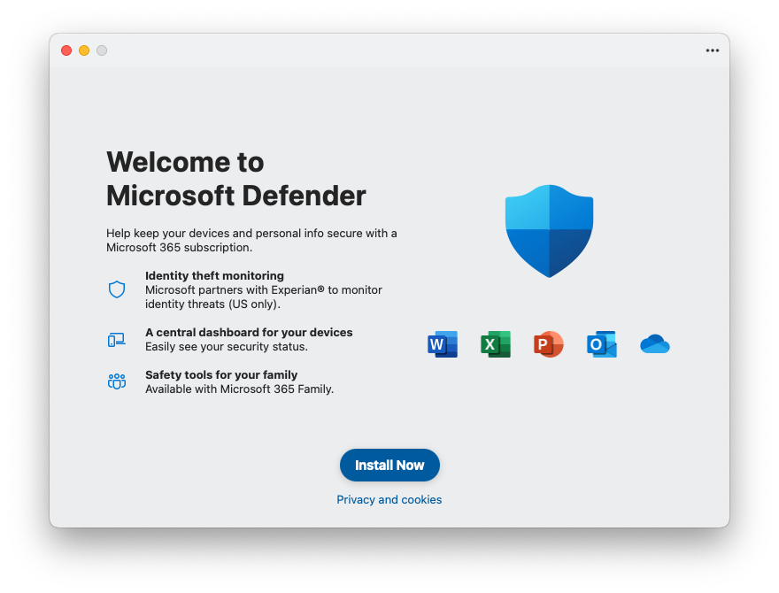

# Scripts for Microsoft 365 Apps for Mac

These sample scripts provide examples of how to use [Intune Shell Scripting](https://docs.microsoft.com/en-us/mem/intune/apps/macos-shell-scripts) to deploy and manage Microsoft 365 Apps for Mac.

**Everything in this repo is provided as sample code and you are responsible for testing before deploying into your own environment**

## Overview of sample files in this area of the repo

```
├── MAU Plist
│   ├── com.microsoft.autoupdate2_beta.plist                 # Intune Managed Preference File to configure MAU to Beta Channel
│   ├── com.microsoft.autoupdate2_current.plist              # Intune Managed Preference File to configure MAU to Current Channel
│   └── com.microsoft.autoupdate2_preview.plist              # Intune Managed Preference File to configure MAU to Preview Channel
├── Outlook
│   ├── installOutlookResetPreferences.sh                    # Resets Outlook Preferences
│   ├── installOutlookResetRecentAddressesTool.sh            # Resets Outlook Recent Addresses
│   └── setOutlookasDefaultMailClient.sh                     # Sets Outlook to default client for e-Mail and Calendar
│
│── com.microsoft.office_installcontrols.plist              # Option 1: Managed Preference File to control which parts of the Microsoft 365 Apps are installed
│── Microsoft 365 Apps - Installation Control.mobileconfig  # Option 2: Managed Configuration Profile to control which parts of the Microsoft 365 Apps are installed
├── detectDefenderShim.zsh                                  # Script to detect or remove the Defender Shim
├── installM365Apps.sh                                      # Install latest Microsoft 365 Apps for Mac
├── installOffice365Pro_individual.zsh                      # Install latest Office 365 for Mac with controls over which apps get installed
└── uninstallOfficeBusinessPro.sh                           # Script to remove Office 365 Business Pro
```


# **[IMPORTANT]** Defender Shim

From Oct 2023 Microsoft 365 Apps for Mac includes a shim for Defender. If you are not using Defender in your environment, you can prevent this from being installed by using this preference file with InstallDefender to to false. This changed was notified via [MC661225](https://admin.microsoft.com/AdminPortal/Home?ref=MessageCenter/:/messages/MC661225).

**Information**: Click [here](https://macadmins.software/shim/) to learn more about the Defender Shim and how it works.



## Using Microsoft 365 Apps PLIST-file (Option 1) or Configuration Profile (Option 2) to **avoid** installing the Defender Shim

The Microsoft 365 Apps for Mac allows you to control which applications get installed via either a [PLIST-file (Option 1)](https://learn.microsoft.com/en-us/mem/intune/configuration/preference-file-settings-macos) or using Configuration Profile (Option 2) from this site. For PLIST-file, you can start with the example **com.microsoft.office_installcontrols.plist** and modify as required.

You can find more information in the [Office for Mac deployment documentation](https://learn.microsoft.com/en-us/deployoffice/mac/preferences-office#excluding-apps).

You should set the Preference domain name for this managed PLIST-file to : **com.microsoft.office**


> [!NOTE]  
> We also provide configuration profile alternative that is also easy to modify and deploy. Configuration profile already contains needed preference domain. Using configuration profile provides possibility to deploy multiple configuration profiles to same preference without having possible risk of conflict of settings deployment.

## Detection and Removal Script [detectDefenderShim.zsh]

Ok, so you missed the message centre announcement and now you've got the Defender shim installed all over your managed Macs, what can you do?

The script **detectDefenderShim.zsh** can be used as both a detection tool and removal tool.

### Detection

In detection mode, the script looks for some key binaries and attempts to determine if the Defender Shim is installed or not. It's best to run this via an [Intune Custom Attribute Script](https://learn.microsoft.com/en-us/mem/intune/apps/macos-shell-scripts#custom-attributes-for-macos), which will report back the detected state of Defender for each machine.

To ensure that the script runs in detect only mode, edit the script as:

```
removeShim="false"
```

The script has the following possible outputs

| **Staus**                    | **Description**                                                   |
|------------------------------|-------------------------------------------------------------------|
| **Defender Shim Detected**   | Script detected that the Defender Shim was installed              |
| **Defender Client Detected** | Script detected that the Defender Client was installed            |
| **Defender Not Installed**   | Script detected that Defender was not installed                   |
| **Error Detecting Defender** | Script was unable to determine the state of Defender installation |


### Removal

**WARNING** This script is provided as a sample and has no warrantly, implied or otherwise. The responsibility is on you to validate and test before deploying into production. Any script that removes files is potentially dangerous and you should be confident in how it functions before deploying.

In removal mode, if the shim is detected, it will be removed. To put the script into removal mode set the following to true.

```
removeShim="true"
```

